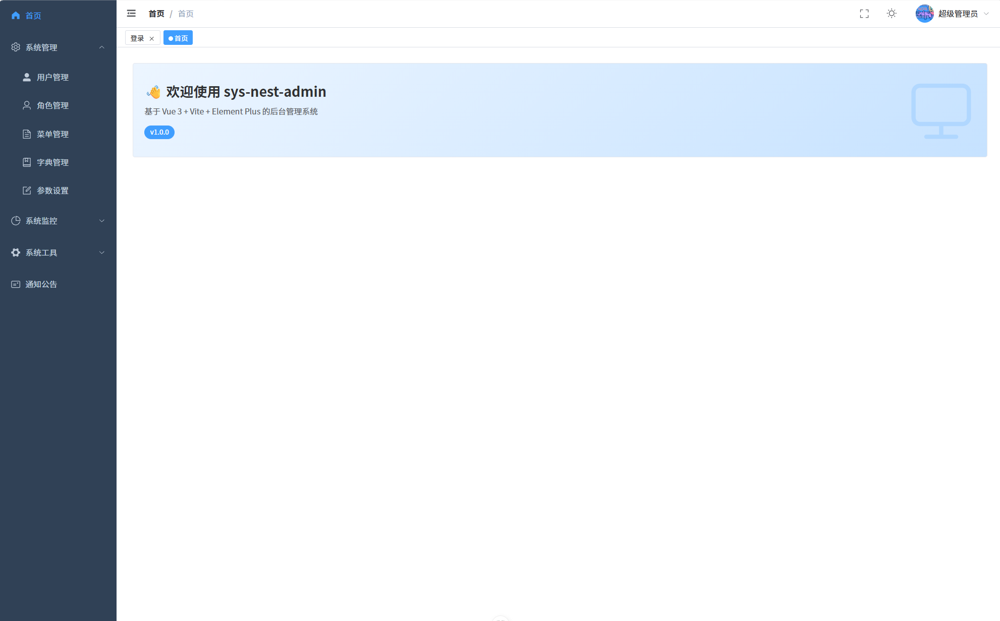

# sys-nest-admin

一个基于 **NestJS + Vue 3** 的通用后台管理系统，采用前后端分离架构，内置用户、角色、菜单、字典、定时任务、日志、配置、通知、在线用户、服务监控等常用后台能力。

## 项目演示

### 首页



## 目录

- [项目演示](#项目演示)
  - [首页](#首页)
- [技术栈](#技术栈)
  - [后端（server）](#后端server)
  - [前端（web-admin）](#前端web-admin)
- [项目结构](#项目结构)
  - [后端目录结构](#后端目录结构)
  - [前端目录结构](#前端目录结构)
- [后端规范](#后端规范)
  - [全局约定](#全局约定)
  - [命名与分层](#命名与分层)
  - [权限标识](#权限标识)
  - [错误码](#错误码)
  - [配置说明](#配置说明)
- [前端规范](#前端规范)
  - [代码风格](#代码风格)
  - [API 接口层](#api-接口层)
  - [标准页面布局](#标准页面布局)
  - [路由](#路由)
  - [交互约定](#交互约定)
  - [环境变量](#环境变量)
- [快速开始](#快速开始)
  - [环境要求](#环境要求)
  - [1. 初始化数据库](#1-初始化数据库)
  - [2. 启动后端](#2-启动后端)
  - [3. 启动前端](#3-启动前端)
  - [前端打包](#前端打包)
  - [4. 同时运行](#4-同时运行)
- [默认账号](#默认账号)
- [相关文档](#相关文档)

---

## 技术栈

### 后端（server）

| 分类 | 技术 |
| --- | --- |
| 框架 | NestJS 11 |
| 语言 | TypeScript 5.7 |
| ORM | TypeORM 0.3 |
| 数据库 | MySQL 8+ |
| 缓存 | Redis（ioredis） |
| 认证 | Passport + JWT（双 Token：access / refresh） |
| 接口文档 | Swagger（swagger-ui-express） |
| 校验 | class-validator + class-transformer |
| 密码加密 | bcrypt |
| 验证码 | svg-captcha |
| 定时任务 | @nestjs/schedule + cron |
| 服务监控 | systeminformation |
| 包管理 | pnpm |

### 前端（web-admin）

| 分类 | 技术 |
| --- | --- |
| 框架 | Vue 3.5（Composition API，`<script setup lang="ts">`） |
| 语言 | TypeScript 6.0 |
| 构建工具 | Vite 8 |
| UI 组件库 | Element Plus 2.13+（自动导入） |
| 图标 | @element-plus/icons-vue |
| 状态管理 | Pinia |
| 路由 | Vue Router 5 |
| HTTP | Axios |
| 图表 | ECharts 6 |
| 包管理 | pnpm |

---

## 项目结构

```
nest-admin/
├── server/                # 后端服务（NestJS）
└── web-admin/             # 前端应用（Vue 3 + Vite）
```

### 后端目录结构

```
server/
├── config/                       # 环境配置
│   ├── development.yml           # 开发环境配置
│   └── production.yml            # 生产环境配置
├── sql/
│   └── init.sql                  # 数据库初始化脚本（含表结构与初始数据）
├── Prompt/                       # 开发规范文档
├── src/
│   ├── common/                   # 公共模块
│   │   ├── decorators/           # 自定义装饰器（@Permission / @Log / @Roles / @User）
│   │   ├── dto/                  # 公共 DTO（BasePaginationDto / ResponseDto 等）
│   │   ├── entities/             # 公共实体基类 BaseEntity
│   │   ├── enums/                # 枚举（错误码、状态、业务类型、配置键等）
│   │   ├── exceptions/           # 自定义业务异常 BusinessException
│   │   ├── filters/              # 异常过滤器（HTTP / 业务异常）
│   │   ├── guards/               # 守卫（JWT 鉴权 / 权限 / 角色）
│   │   ├── interceptors/         # 拦截器（日志 / 统一响应转换）
│   │   ├── interfaces/           # 公共接口
│   │   ├── services/             # 公共服务（文件上传 FileService）
│   │   ├── utils/                # 工具函数（菜单构建、UA 解析等）
│   │   └── vo/                   # 公共 VO 基类 BaseVo
│   ├── core/                     # 核心模块
│   │   ├── config/               # 配置管理 ConfigService
│   │   ├── database/             # 数据库连接
│   │   └── redis/                # Redis 缓存服务
│   ├── modules/                  # 业务模块
│   │   ├── auth/                 # 认证（登录、刷新 Token、登出）
│   │   ├── captcha/              # 验证码
│   │   ├── user/                 # 用户管理
│   │   ├── role/                 # 角色管理
│   │   ├── menu/                 # 菜单管理
│   │   ├── dict/                 # 字典类型 / 字典数据 / 字段分组
│   │   ├── config/               # 参数配置
│   │   ├── notice/               # 通知公告
│   │   ├── job/                  # 定时任务 + 任务日志
│   │   ├── log/                  # 操作日志 + 登录日志
│   │   ├── cache/                # 缓存监控
│   │   ├── online/               # 在线用户
│   │   └── server/               # 服务监控
│   ├── types/                    # 类型声明补充
│   ├── app.module.ts             # 根模块
│   └── main.ts                   # 应用入口
└── package.json
```

每个业务模块遵循统一的分层结构：

```
modules/{module}/
├── dto/                # 数据传输对象（Create / Update / Query / BatchDelete）
├── entities/           # TypeORM 实体
├── vo/                 # 视图对象（响应数据结构）
├── repository/         # 数据访问层（部分模块）
├── {module}.controller.ts   # 控制器
├── {module}.service.ts      # 业务逻辑
└── {module}.module.ts       # 模块定义
```

### 前端目录结构

```
web-admin/
├── public/                       # 静态资源
├── src/
│   ├── api/                      # 接口请求层
│   │   ├── system/               # 系统管理接口（user/role/menu/dict...）
│   │   └── monitor/              # 监控接口（cache/online/server）
│   ├── assets/                   # 样式与静态资源
│   │   └── styles/               # 全局样式 + 主题变量
│   ├── components/               # 全局公共组件（DictTag / ThemeSwitch）
│   ├── config/                   # 应用配置
│   ├── constants/                # 常量
│   ├── directives/               # 自定义指令（权限指令 v-permission）
│   ├── hooks/                    # 组合式函数（useDict / useMenu / useTheme）
│   ├── layouts/                  # 布局
│   │   ├── DefaultLayout/        # 默认布局（含 Sidebar/Navbar/TagsView/Breadcrumb）
│   │   ├── BlankLayout/          # 空白布局
│   │   ├── InnerLink/            # 内链布局
│   │   └── ParentView/           # 父级容器
│   ├── router/                   # 路由
│   │   ├── modules/              # 路由模块（dashboard/system/monitor/error）
│   │   ├── guards.ts             # 路由守卫
│   │   └── whiteList.ts          # 白名单
│   ├── stores/                   # Pinia 状态
│   │   └── modules/              # app / user / permission
│   ├── types/                    # 全局类型
│   ├── utils/                    # 工具
│   │   ├── request/              # Axios 封装（service / errorCode）
│   │   ├── auth.ts               # Token 管理
│   │   ├── theme.ts              # 主题
│   │   └── ...                   # 其他工具
│   ├── views/                    # 页面视图
│   │   ├── dashboard/            # 首页
│   │   ├── login/                # 登录
│   │   ├── system/               # 系统管理页面
│   │   ├── monitor/              # 系统监控页面
│   │   └── error/                # 错误页（403/404/500...）
│   ├── App.vue
│   └── main.ts
├── .env / .env.development / .env.production   # 环境变量
├── vite.config.ts                # Vite 配置（含 /admin 代理）
└── package.json
```

---

## 后端规范

> 完整规范见 [`server/Prompt/后台一般标准页的api规范.txt`](server/Prompt/后台一般标准页的api规范.txt)，以下为要点摘录。

### 全局约定

- **全局路由前缀**：接口前缀按环境区分，开发环境为 `/dev-api`，生产环境为 `/prod-api`（由配置文件 `app.apiPrefix` 控制），例如开发环境 `GET /dev-api/user`、生产环境 `GET /prod-api/user`。
- **统一响应格式**（由 `TransformInterceptor` 自动包装，Controller 直接返回数据即可）：

  ```json
  { "code": 200, "msg": "success", "data": { ... } }
  ```

- **统一异常格式**（由 `BusinessExceptionFilter` / `HttpExceptionFilter` 自动处理）：

  ```json
  { "code": 1001, "msg": "错误信息", "data": null }
  ```

- **Swagger 文档**：启动后访问 `http://localhost:3000/api`，JSON 可导入 Apifox：`http://localhost:3000/api-json`。

### 命名与分层

- **实体（Entity）**：继承 `BaseEntity`，表名 `sys_{module}`，每个字段必须有 `comment`，软删除字段由基类提供（`deleteStatus`）。
- **DTO**：`CreateXxxDto` / `UpdateXxxDto`（`PartialType`）/ `QueryXxxDto`（继承 `BasePaginationDto`）/ `BatchDeleteDto`；含文件上传时额外定义 `XxxFormDto`。
- **VO**：继承 `BaseVo`（自动含 id/createdAt/updatedAt），列表接口返回 `{ list, total }`，不返回敏感字段。
- **Repository**：所有查询过滤 `deleteStatus='0'`；`findById` 返回 `Promise<T | null>`，`findAll` 返回 `Promise<{ list, total }>`。
- **Service**：入参 DTO，出参 VO；`create/update` 接收 `username` 记录操作人；通过私有 `toXxxVo()` 做实体到 VO 转换。
- **Controller**：类级装饰器顺序 `@ApiTags` → `@Controller` → `@UseGuards(JwtAuthGuard)` → `@ApiBearerAuth()`；每个接口必须有 `@ApiOperation`、`@Permission`、`@Log`；创建/更新返回 `Promise<void>`。

### 权限标识

采用 `模块:资源:动作` 三段式，例如：

- `system:user:list` / `system:user:add` / `system:user:edit` / `system:user:delete`
- 超级管理员（配置项 `app.admin`）跳过权限校验。

### 错误码

按业务分段，详见 [`src/common/enums/error-code.enum.ts`](server/src/common/enums/error-code.enum.ts)：

- `200` 成功 / `4xx` HTTP 异常 / `5xx` 服务异常
- `1xxx` 用户相关 / `2xxx` 验证码 / `3xxx` Token / `4xxx` 权限 / `5xxx` 参数 / `6xxx` 配置

抛错方式：`throw new BusinessException('描述', ErrorCodeEnum.XXX)`。

### 配置说明

开发环境配置 [`config/development.yml`](server/config/development.yml) 关键项：

| 配置项 | 默认值 | 说明 |
| --- | --- | --- |
| `server.port` | 3000 | 后端端口 |
| `app.apiPrefix` | dev-api（开发）/ prod-api（生产） | 全局接口前缀 |
| `swagger.serverUrl` | `http://localhost:3000/dev-api` / `https://nest-admin.dooring.vip/prod-api` | Swagger Servers 展示地址，包含环境前缀 |
| `database` | localhost:3306 / h-vue | MySQL 连接，开发环境 `synchronize: true` |
| `redis` | localhost:6379 db=2 | Redis 连接 |
| `jwt.accessTokenExpiresIn` | 2h | 访问 Token 有效期 |
| `jwt.refreshTokenExpiresIn` | 7d | 刷新 Token 有效期 |
| `app.admin` | admin | 超级管理员用户名 |

---

## 前端规范

> 完整规范见 [`web-admin/Prompt/一般标准页.txt`](web-admin/Prompt/一般标准页.txt)，以下为要点摘录。

### 代码风格

- 不加分号、单引号、行宽 100、缩进 2 空格（Prettier + ESLint）。
- 组件无需手动导入（Element Plus 已配置自动导入）；图标需从 `@element-plus/icons-vue` 手动 import。
- 函数、变量、类型使用 JSDoc 注释（`@description` / `@param` / `@example`）。
- 路径别名 `@` → `src`。

### API 接口层

- 位置：`src/api/{module}/xxx.ts`，在 `index.ts` 中统一聚合导出。
- 类型命名：`XxxVo`（视图对象）、`QueryXxxParams extends PageParams`、`CreateXxxParams`、`UpdateXxxParams`。
- 接口返回值由 Axios 拦截器自动解包 `data`，业务层直接使用，无需 `.data`。
- GET 列表返回 `PaginationResult<XxxVo>`（`{ list, total }`）；POST/PUT/DELETE 返回 `void`。
- 错误统一由请求拦截器 `ElMessage.error` 提示，业务层 `catch` 可留空。

### 标准页面布局

页面采用 `.page-container`（flex column，padding 20px，gap 16px）包裹，自上而下：

1. **筛选区** `search-card`：`el-card` + `el-form inline`，输入框 `clearable` + 回车搜索。
2. **表格操作栏** `table-action-bar`：左侧新增/批量删除，右侧刷新。
3. **表格区** `table-card`：`el-table`，首列多选、状态列用 `el-tag`、操作列 `fixed="right"`、危险操作 `el-popconfirm` 二次确认。
4. **分页区** `pagination-wrapper`：`el-pagination`，`page-sizes=[10,20,50,100]`。
5. **新增/编辑弹窗** `el-dialog`（width 560px，`:close-on-click-modal="false"`，`@close` 重置表单）。

### 路由

- 位置：`src/router/modules/{module}.ts`，使用 `DefaultLayout` 作为父级。
- 子路由 `path` 相对、`name` PascalCase，组件动态 `import` 懒加载，`meta` 必含 `title` 和 `icon`。

### 交互约定

- 搜索/重置：均重置 `page=1` 后查询；重置额外清空筛选字段。
- 新增：`dialogType='create'` → 重置表单 → 打开弹窗 → `nextTick` 清除校验。
- 编辑：先请求详情回填 → `dialogType='edit'` → 打开弹窗。
- 删除：单条 `el-popconfirm`，批量 `ElMessageBox.confirm`，成功后刷新列表并清空选中。

### 环境变量

| 文件 | 用途 | 关键变量 |
| --- | --- | --- |
| `.env` | 公共配置 | `VITE_PORT=5173`、`VITE_API_TIMEOUT=15000` |
| `.env.development` | 开发 | `VITE_API_BASE_URL=/dev-api`、`VITE_API_PROXY_TARGET=http://localhost:3000` |
| `.env.production` | 生产 | `VITE_API_BASE_URL=/prod-api`（按需替换为实际域名） |

> 开发环境通过 Vite 代理把 `/dev-api/*`、`/uploads/*` 转发到后端 `http://localhost:3000`，自动解决跨域。

---

## 快速开始

### 环境要求

- Node.js `^20.19.0 || >=22.12.0`
- pnpm（推荐最新版）
- MySQL 8+（开发库默认 `h-vue`）
- Redis（默认 db=2）

### 1. 初始化数据库

1. 创建数据库 `h-vue`（utf8mb4）。
2. 导入初始化脚本：

   ```bash
   mysql -u root -p h-vue < server/sql/init.sql
   ```

   或使用 Navicat / DBeaver 等工具执行 [`server/sql/init.sql`](server/sql/init.sql)。

### 2. 启动后端

```bash
cd server

# 安装依赖
pnpm install

# 按需修改配置（数据库账号密码、Redis 等）
# 编辑 config/development.yml

# 开发模式启动（默认监听 3000 端口）
pnpm dev
```

启动成功后：

- 接口地址：`http://localhost:3000/dev-api`（开发环境前缀）
- Swagger 文档：`http://localhost:3000/api`
  - Servers 展示：`http://localhost:3000/dev-api`
  - 接口路径展示：仅模块路径，不带 `/dev-api` 前缀

> 生产构建：`pnpm build` → `pnpm start:prod`（需先修改 `config/production.yml`，注意 `synchronize: false`）。

### 3. 启动前端

```bash
cd web-admin

# 安装依赖
pnpm install

# 开发模式启动（默认监听 5173 端口，自动打开浏览器）
pnpm dev
```

访问 `http://localhost:5173` 即可使用。

### 前端打包

进入 `web-admin` 目录，根据目标环境选择命令：

| 命令 | 加载的环境文件 | API 基础地址 | 用途 |
| --- | --- | --- | --- |
| `pnpm dev` | `.env.development` | `/dev-api` | 本地开发 |
| `pnpm build:dev` | `.env.development` | `/dev-api` | 打包开发环境版本 |
| `pnpm build:prod` | `.env.production` | `/prod-api` | 打包生产环境版本 |
| `pnpm build:staging` | `.env.staging` | 按 `.env.staging` 配置 | 打包预发布环境版本 |

构建产物输出到 `web-admin/dist/` 目录。生产部署时，需要在 Nginx 等反向代理中将 `/prod-api/*` 转发到后端服务地址，例如：

```nginx
location /prod-api/ {
    proxy_pass http://localhost:3000/prod-api/;
    proxy_set_header Host $host;
    proxy_set_header X-Real-IP $remote_addr;
}
```

> 生产环境 `VITE_API_BASE_URL` 也可改为完整域名（如 `https://api.yourdomain.com/prod-api`），具体取决于部署方式。

### 4. 同时运行

前后端分别位于 `server/` 与 `web-admin/`，开发时需各开一个终端分别执行 `pnpm dev`。前端已配置代理，请求 `/dev-api/*` 会自动转发到后端 3000 端口，无需额外处理跨域。

---

## 默认账号

| 用户名 | 密码 | 说明 |
| --- | --- | --- |
| admin | 123456 | 超级管理员，跳过所有权限校验 |

> 出于安全考虑，部署到生产环境前请务必修改默认密码与 JWT 密钥（`config/production.yml`）。

---

## 相关文档

- 后端接口开发规范：[`server/Prompt/后台一般标准页的api规范.txt`](server/Prompt/后台一般标准页的api规范.txt)
- 前端标准页生成规范：[`web-admin/Prompt/一般标准页.txt`](web-admin/Prompt/一般标准页.txt)
- 后端目录结构说明：[`server/src/README_STRUCTURE.md`](server/src/README_STRUCTURE.md)
